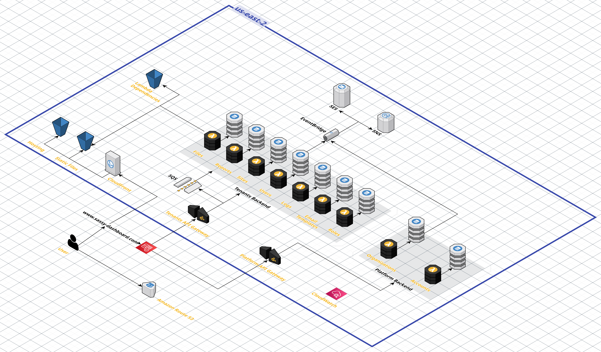

# serverless-saas-dashboard

## Description

The serverless-saas-dashboard is a web application that allows organizations to keep track of the status of their saas applications as well as their users, roles, and documents. 
## Architecture Diagram

